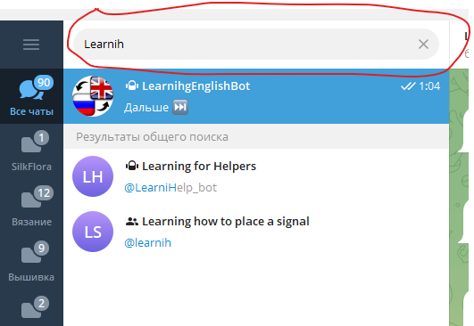

# Telegram Bot "LearnihgEnglishBot" для изучения английских слов

## Описание проекта
Этот Telegram-бот помогает пользователям изучать английские слова через интерактивные карточки. 

Бот позволяет:  
Изучать слова через систему карточек с выбором правильного перевода;  
Добавлять собственные слова в персональную коллекцию;  
Удалять слова из коллекции;  
Собирать индивидуальную базу для обучения.  

## При разработке Telegram Bot "LearnihgEnglishBot" были использованы технологии:

Python 3.8+  
PostgreSQL - база данных  
SQLAlchemy - ORM для работы с БД  
pyTeleBot - библиотека для Telegram API  
psycopg2 - драйвер PostgreSQL для Python  

### Структура проекта

telegramBot/  
├── main.py              -- Основной файл бота  
├── bd_functions.py      -- Функции работы с базой данных  
├── classes.py           -- Модели SQLAlchemy  
├── settings.ini         -- Конфигурация (создается вручную)  
├── requirements.txt     -- Зависимости Python  
└── README.md            -- Документация  

## Модели базы данных

### Основные таблицы:
users - пользователи бота  
target_words - слова для изучения (русские)  
translate_words - правильные переводы  
others_words - неправильные варианты перевода  
user_target_relations - связи пользователей со словами  

## Установка

В месенджере телеграмм в поле поиска начать вводить имя бота LearnihgEnglishBot

из появившегося списка выбираем по полному имени
в открывшемся окне сообщений вводим команду /start или /cards

## Основные команды:
/start или /cards - начать обучение, показать первую карточку  
Дальше ⏭ - следующая карточка  
Добавить слово ➕ - добавить новое слово в коллекцию  
Удалить слово 🔙 - удалить слово из коллекции  

## Процесс обучения:

### Просмотр карточек:
Бот показывает русское слово и 4 варианта перевода на английский  
Один вариант правильный, три - неправильных  
Выберите правильный перевод  

### Добавление слов:
Нажмите "Добавить слово ➕"  
Следуйте инструкциям бота:  
Введите слово на русском  
Введите правильный перевод  
Введите 3 варианта неправильных переводов  

### Удаление слов:
Нажмите "Удалить слово 🔙"  
Введите слово на русском, которое хотите удалить  
Бот проверит, что слово существует в вашей коллекции  

### Особенности:
Минимальный порог в 5 слов - нельзя удалить слова, если останется меньше 5  
Системные слова доступны всем пользователям  
Пользовательские слова видны только их создателю  
При неправильном ответе кнопка помечается ❌ 